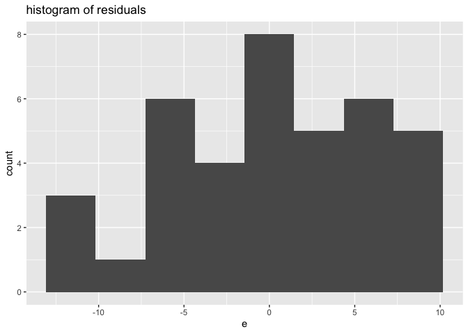
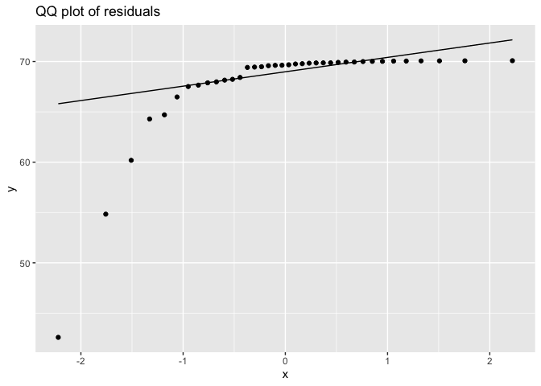

HDAT9600 Team Based Learning Activity
================
Mark Hanly
08 Mar 2022

### Housekeeping

📹 Cameras and recording

💻 Linear models assessment open. Due 9am Monday 14 March.

🤔 Follow up on questions from last week

-----

### TBLA Submissions

#### 🎈 Lot’s of great work—well done\!

Let’s discuss.

## Introduction

In this task, you will use a dataset called `tvdoctor` which is
contained in the *faraway* package for R which you should already have
installed. If not, install it now using the Packages tab in RStudio or
the `install.packages()` function at R console prompt.

The origins of this dataset are unknown, and therefore its veracity
should be viewed with some suspicion, but it purports to contain data
collected in 1993 for life expectancy (the `life` variable), the number
of people per television set `tv`, and the number of people per doctor
`doctor` in 38 different countries. Obviously this is a rather
inadequate dataset, even if the data are real, but it is useful for
teaching purposes.

## Accessing the data

We can use the `data()` function from the `utils` package to load the
data into the R environment, and the `head()` function to take a sneak
peek.

    ##            life    tv doctor
    ## Argentina  70.5   4.0    370
    ## Bangladesh 53.5 315.0   6166
    ## Brazil     65.0   4.0    684
    ## Canada     76.5   1.7    449
    ## China      70.0   8.0    643
    ## Colombia   71.0   5.6   1551

## Instructions

1.  Fit a linear regression model to the `tvdoctor` dataset using `life`
    as the outcome (response) variable and the other two variables as
    predictors. Print the model summary and provide a brief
    interpretation for the model estimates.
2.  Check the normality assumption for the errors using plots and/ or
    statistical tests. Discuss on what you find.
3.  Check the constant variance assumption for the errors using plots
    and/ or statistical tests. Discuss on what you find.

***Note that we will discuss your findings and interpretation in the
online tutorial***

## Sample Submission

### 1\. Fit a linear regression model to the `tvdoctor` dataset using `life` as the outcome (response) variable and the other two variables as predictors. Print the model summary and provide a brief interpretation for the model estimates.

The model results are presented below.

    ## 
    ## Call:
    ## lm(formula = life ~ tv + doctor, data = tvdoctor)
    ## 
    ## Residuals:
    ##      Min       1Q   Median       3Q      Max 
    ## -11.2894  -4.6266   0.3977   5.0872   9.0535 
    ## 
    ## Coefficients:
    ##               Estimate Std. Error t value Pr(>|t|)    
    ## (Intercept) 70.2519573  1.0877047  64.587   <2e-16 ***
    ## tv          -0.0234954  0.0096469  -2.436   0.0201 *  
    ## doctor      -0.0004320  0.0002023  -2.136   0.0398 *  
    ## ---
    ## Signif. codes:  0 '***' 0.001 '**' 0.01 '*' 0.05 '.' 0.1 ' ' 1
    ## 
    ## Residual standard error: 6.003 on 35 degrees of freedom
    ## Multiple R-squared:   0.44,  Adjusted R-squared:  0.408 
    ## F-statistic: 13.75 on 2 and 35 DF,  p-value: 3.916e-05

    ##                     2.5 %        97.5 %
    ## (Intercept) 68.0437994245  7.246012e+01
    ## tv          -0.0430795581 -3.911172e-03
    ## doctor      -0.0008427015 -2.139253e-05

*_How do we interpret these? Write down a sentence for the
interpretation of the tv parameter_*

### 2\. Check the normality assumption for the errors using plots and/ or statistical tests.

<!-- --><!-- -->

***So how do we feel about these?***

We can also test this formatlly with the Shapiro-Wilks test:

``` r
shapiro.test(tvdoctor$e)
```

    ## 
    ##  Shapiro-Wilk normality test
    ## 
    ## data:  tvdoctor$e
    ## W = 0.95872, p-value = 0.1725

For this test the null hypothesis is that the residuals are normal. The
p-value is relatively high so we do not reject this hypothesis. That’s
not to say that the residuals are perfectly normally distributed, just
that there is not sufficient statistically-significant evidence to
conclude that they are not normal.

### Check the constant variance assumption for the errors using plots and/ or statistical tests.

<!-- -->

***How do we feel about these?***

We can also perform a statistical test to test for non-constant variance
with the Breusch-Pagan test.

``` r
# Breusch-Pagan test from olsrr library
olsrr::ols_test_breusch_pagan(mod1, rhs=TRUE)
```

    ## 
    ##  Breusch Pagan Test for Heteroskedasticity
    ##  -----------------------------------------
    ##  Ho: the variance is constant            
    ##  Ha: the variance is not constant        
    ## 
    ##         Data         
    ##  --------------------
    ##  Response : life 
    ##  Variables: tv doctor 
    ## 
    ##         Test Summary         
    ##  ----------------------------
    ##  DF            =    2 
    ##  Chi2          =    2.461572 
    ##  Prob > Chi2   =    0.2920629

The null hypothesis for this test is that the variance is constant. The
p-value is relatively high so we do not reject this null hypothesis.

-----
